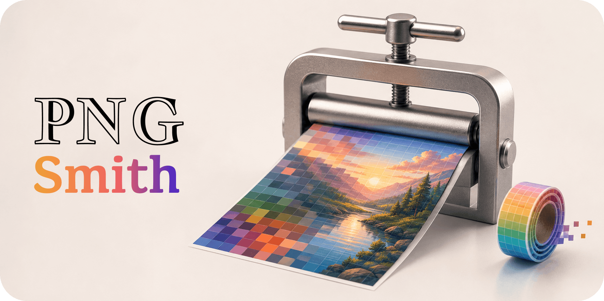
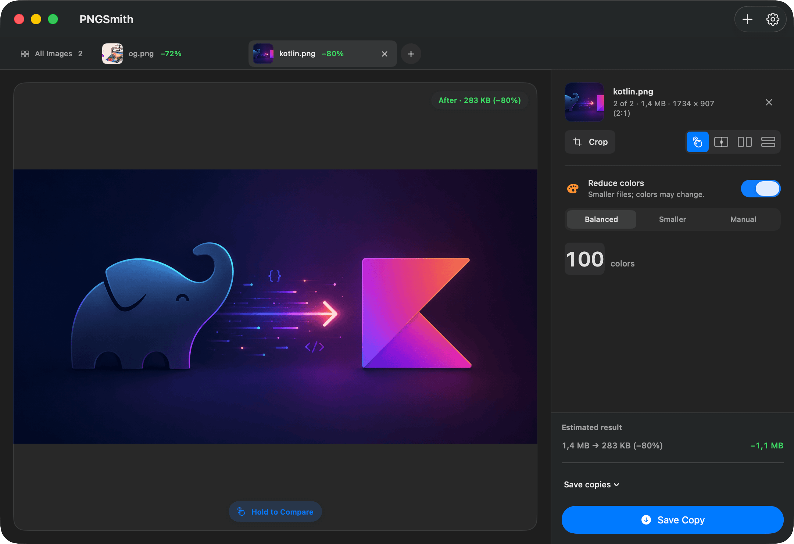

# PNGSmith

<p align="center">
  
</p>

<p align="center">
  
  
  
  <a href="LICENSE"></a>
</p>

PNGSmith compresses PNG files on macOS. Drop in an image or a folder, compare the result with the original, then save a copy or replace the source.

Compression runs locally, and metadata is preserved by default.

<p align="center">
  
</p>

## Features

- **Lossless compression** — Re-encode PNGs without changing their decoded pixels
- **Color reduction** — Choose Balanced, Smaller, or a manual limit from 2 to 256 colors
- **Before-and-after comparison** — Hold to reveal the original, drag a divider, or view both images side by side
- **Batch processing** — Drop in several images or an entire folder; each image keeps its own settings
- **Cropping** — Crop an image before compression
- **Safe to run again** — Balanced and Smaller leave already reduced images unchanged instead of reducing their colors again
- **Animated PNG support** — Preserve every frame; PNGSmith automatically uses lossless compression
- **macOS automation** — Use PNGSmith from Finder Quick Actions, Services, Shortcuts, or the CLI
- **Session restore** — Reopen the images from your previous session

## Compression Modes

| Mode | Behavior | Best for |
|---|---|---|
| **Lossless** | Keeps every decoded pixel identical | Source images, screenshots, and UI assets |
| **Balanced** | Carefully combines similar colors | Most web images |
| **Smaller** | Reduces colors more aggressively | Images where file size matters most |
| **Manual** | Uses a color limit from 2 to 256 | Precise palette control |

## Installation

Sign in to Xcode, then build and install a signed copy in `~/Applications`:

```bash
brew install xcodegen
./scripts/development-install.sh YOUR_APPLE_TEAM_ID
```

## Requirements

- macOS 26+
- Xcode 26+
- Rust 1.85.1+
- [XcodeGen](https://github.com/yonaskolb/XcodeGen)

## CLI

```bash
cargo build --release --package pngsmith-cli --all-features

# Lossless compression → image_min.png
target/release/pngsmith image.png

# Reduce to at most 64 colors
target/release/pngsmith --mode perceptual --colors 64 image.png

# Choose a color limit automatically
target/release/pngsmith --mode auto --auto-strategy balanced image.png
```

The app, Finder integrations, Shortcuts action, and CLI all use the same Rust compression core. A C ABI is available for other integrations.

## Development

See the [developer guide](docs/DEVELOPMENT.md) for builds, tests, architecture, the JSON API, and releases.
